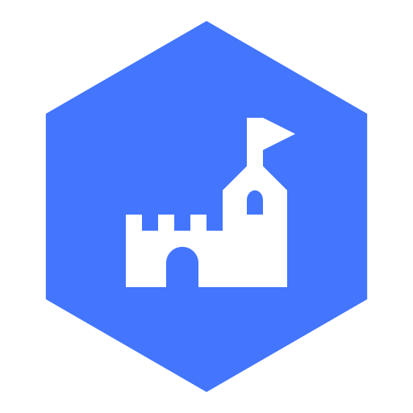
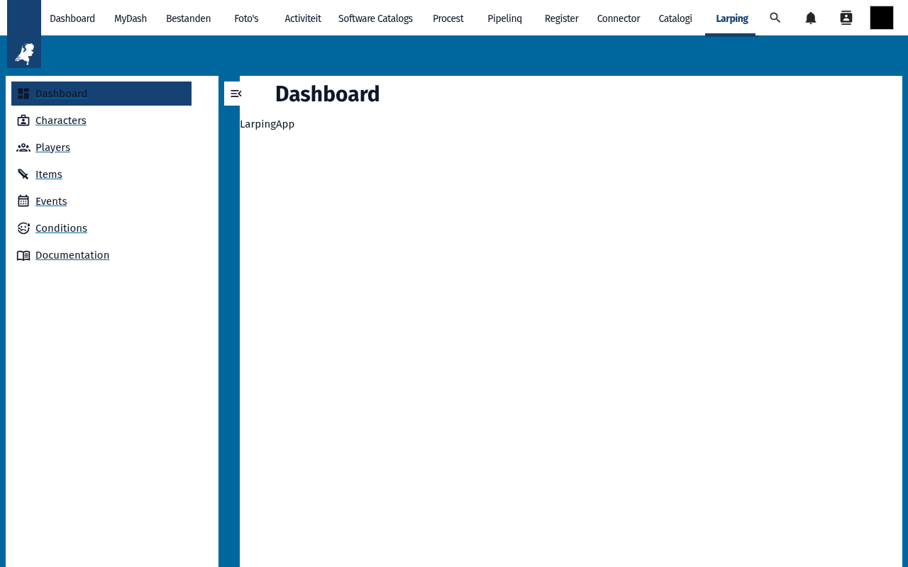
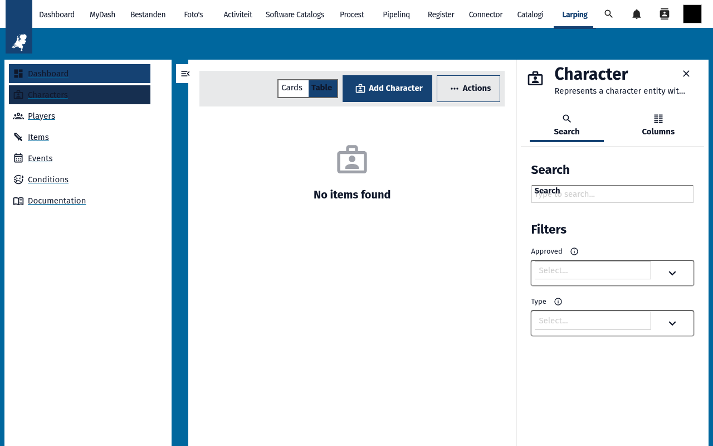
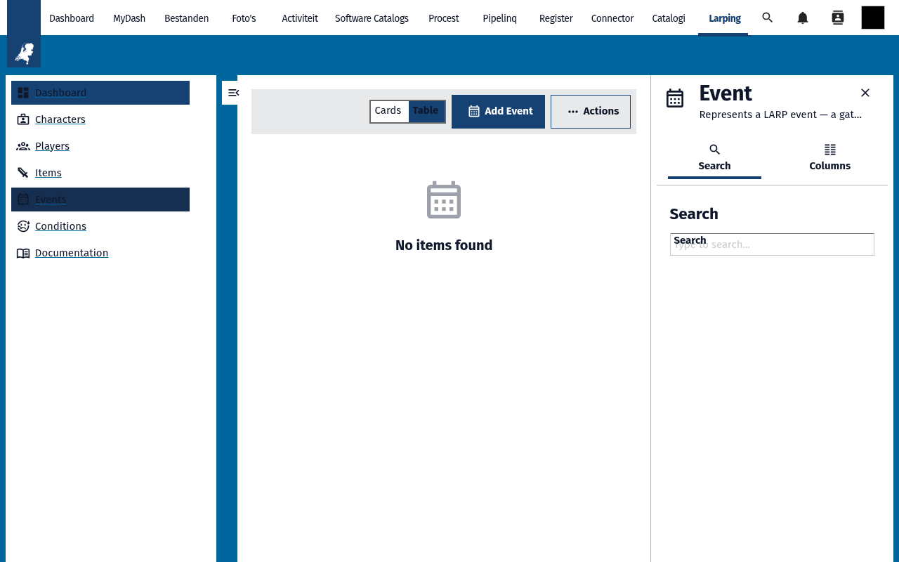
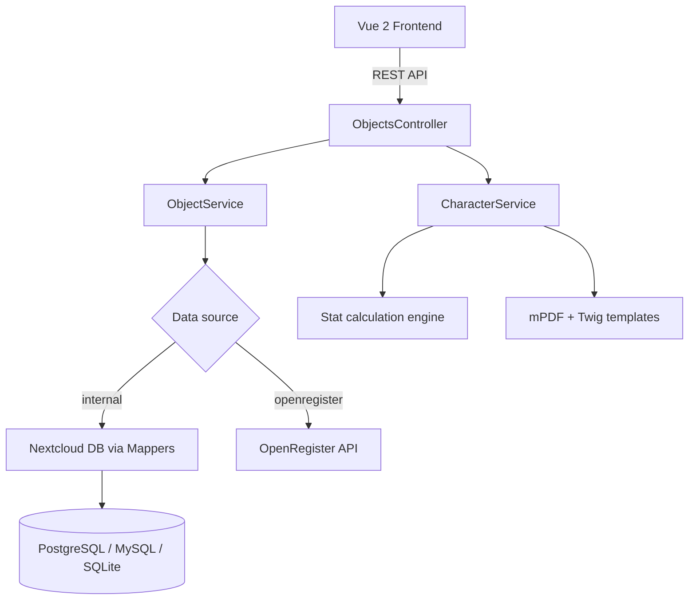

<p align="center">
  
</p>

<h1 align="center">Larping</h1>

<p align="center">
  <strong>LARP character and event management for Nextcloud — skills, items, conditions, and dynamic stat calculation</strong>
</p>

<p align="center">
  <a href="https://github.com/ConductionNL/larpingapp/releases"></a>
  <a href="https://github.com/ConductionNL/larpingapp/blob/main/LICENSE"></a>
  <a href="https://github.com/ConductionNL/larpingapp/actions"></a>
  <a href="https://larpingapp.app"></a>
</p>

---

Larping brings live-action role-playing management natively into Nextcloud. Game masters define abilities, skills, items, conditions, and effects; the app automatically computes each character's stats and keeps them synchronized as game state changes. Players register for events, track XP, and print their character sheet — all without leaving Nextcloud.

> **Optional:** [OpenRegister](https://github.com/ConductionNL/openregister) — enables advanced features like audit trails, object locking, cross-object relations, and JSON-based data storage.

## Screenshots

<table>
  <tr>
    <td></td>
    <td></td>
    <td></td>
  </tr>
  <tr>
    <td align="center"><em>Dashboard</em></td>
    <td align="center"><em>Characters</em></td>
    <td align="center"><em>Events</em></td>
  </tr>
</table>

## Features

### Character Management
- **Full Character CRUD** — Create player characters and NPCs with name, description, background, faith, and currency (gold, silver, copper)
- **Background Approval** — Game master approval workflow for character backgrounds before gameplay begins
- **Dynamic Stat Calculation** — Abilities are automatically computed from the combined effects of all equipped skills, items, conditions, and active events
- **Stat Audit Trail** — See exactly which skills, items, and conditions contribute to each ability score

### Skills & Effects
- **Skills** — Create skills with effects, experience costs, and prerequisites (required stats, other skills, conditions, or effect values)
- **Items** — Manage unique and non-unique items, each with their own effects; track which characters own each item
- **Conditions** — Define positive and negative conditions (e.g., Poisoned, Blessed) that dynamically affect character abilities
- **Effects System** — Numeric modifiers (cumulative or non-cumulative) that link to one or more abilities; the foundation of all game mechanics

### Events & Players
- **Events** — Create LARP events with date range, location, and participant tracking
- **Event Subscriptions** — Handle registrations and waiting lists; track player participation
- **Post-Event Effects** — Apply effects to characters as a result of event participation
- **Player Profiles** — Manage player accounts linked to their characters with XP tracking

### PDF Generation
- **PDF Export** — Generate printer-ready character sheets from customizable Twig-based HTML templates via mPDF
- **Template Management** — Create and manage multiple sheet templates for different character types or LARP settings
- **On-Demand Generation** — Export any character's sheet at any time with current computed stats

## Architecture



### Data Model

| Entity | Key Properties |
|--------|----------------|
| Character | name, type (player/npc), background, approved, skills[], items[], conditions[], events[], abilities (computed), gold/silver/copper |
| Ability | name, description, base value |
| Skill | name, effects[], requiredSkills[], requiredStats[], requiredConditions[], xpCost |
| Item | name, effects[], unique, characters[] |
| Condition | name, effects[], unique, characters[] |
| Effect | name, modifier (int), cumulative, abilities[] |
| Event | name, startDate, endDate, location, players[], effects[] |
| Player | name, description |
| Template | name, template (HTML/Twig string) |

### Directory Structure

```
larpingapp/
├── appinfo/           # Nextcloud app manifest, routes, navigation
├── lib/               # PHP backend — controllers, services, DB mappers
│   ├── Controller/    # Objects, Characters, Settings, Dashboard
│   ├── Db/            # 10 Entity + Mapper classes
│   ├── Service/       # CharacterService (stat calc + PDF), ObjectService, SearchService
│   └── Migration/     # Database migrations
├── src/               # Vue 2 frontend — components, Pinia stores, views
│   ├── views/         # Dashboard, characters, skills, items, conditions, events, search
│   ├── modals/        # CRUD modals per entity type
│   ├── store/         # Pinia stores per entity
│   └── entities/      # Zod-validated entity classes
├── img/               # App icons and screenshots
├── templates/         # PHP page templates + Twig PDF templates
├── l10n/              # Translations (en, nl)
└── docusaurus/        # Product documentation site (larpingapp.app)
```

## Requirements

| Dependency | Version |
|-----------|---------|
| Nextcloud | 28 – 33 |
| PHP | 8.1+ |
| Database | PostgreSQL 10+, MySQL 8.0+, SQLite |
| [OpenRegister](https://github.com/ConductionNL/openregister) | optional |

## Installation

### From the Nextcloud App Store

1. Go to **Apps** in your Nextcloud instance
2. Search for **Larping**
3. Click **Download and enable**

### From Source

```bash
cd /var/www/html/custom_apps
git clone https://github.com/ConductionNL/larpingapp.git
cd larpingapp
npm install
npm run build
composer install
php occ app:enable larpingapp
```

## Development

### Start the environment

```bash
docker compose -f openregister/docker-compose.yml up -d
```

### Frontend development

```bash
cd larpingapp
npm install
npm run dev        # Watch mode
npm run build      # Production build
```

### Code quality

```bash
# PHP
composer phpcs          # Check coding standards
composer cs:fix         # Auto-fix issues
composer phpmd          # Mess detection
composer phpmetrics     # HTML metrics report

# Frontend
npm run lint            # ESLint
npm run stylelint       # CSS linting
```

## Tech Stack

| Layer | Technology |
|-------|-----------|
| Frontend | Vue 2.7, Pinia, @nextcloud/vue, @conduction/nextcloud-vue |
| Validation | Zod (runtime schema validation for entities) |
| Build | Webpack 5, @nextcloud/webpack-vue-config |
| Backend | PHP 8.1+, Nextcloud App Framework |
| Data | Nextcloud DB (internal) or OpenRegister (optional) |
| PDF | mPDF 8 + Twig 3 |
| Quality | PHPCS, PHPMD, phpmetrics, Psalm, ESLint, Stylelint |

## Documentation

Full documentation is available at **[larpingapp.app](https://larpingapp.app)**

| Page | Description |
|------|-------------|
| [Features](docs/FEATURES.md) | Complete feature specification |
| [Directories](docs/directories.md) | Project directory structure reference |
| [Style Guide](docs/styleguide.md) | Frontend coding conventions |

## Standards & Compliance

- **Accessibility:** WCAG AA
- **Authorization:** RBAC via OpenRegister (when enabled)
- **Audit trail:** Full change history on all objects (via OpenRegister)
- **Localization:** English and Dutch

## Related Apps

- **[OpenRegister](https://github.com/ConductionNL/openregister)** — Object storage layer (optional dependency for advanced features)
- **[OpenCatalogi](https://github.com/ConductionNL/opencatalogi)** — Publication and catalogue management
- **[NL Design](https://github.com/ConductionNL/nldesign)** — Design token theming for Nextcloud

## License

AGPL-3.0-or-later

## Authors

Built by [Conduction](https://conduction.nl) — open-source software for Dutch government and public sector organizations.
