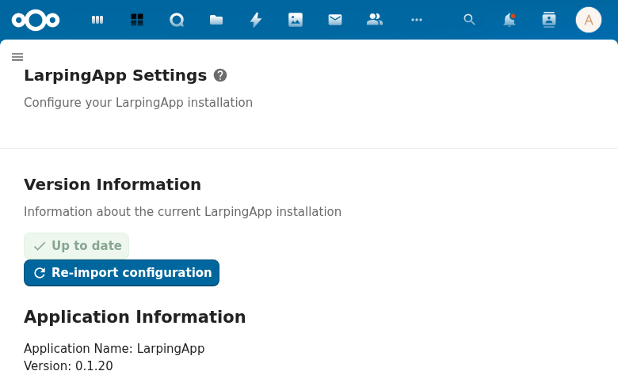

# Admin Settings

## Overview

LarpingApp provides a dedicated admin settings page in the Nextcloud administration panel. Administrators can configure data source settings for each of the 10 entity types (ability, character, condition, effect, event, item, player, setting, skill, template), choosing between internal Nextcloud database storage or OpenRegister.

## How to Use

1. Log in as a Nextcloud administrator
2. Navigate to **Settings** → **Administration** → **LarpingApp**
3. For each entity type, select the data source:
   - **Internal** — uses Nextcloud's built-in database (Entity/Mapper pattern)
   - **Open Register** — uses OpenRegister for JSON object storage with schema validation
4. When selecting OpenRegister, choose the register and schema from the cascading dropdowns
5. Click **Save All** to persist changes

## Screenshots

*The LarpingApp admin settings page in the Nextcloud administration panel.*

## Configuration

Settings are stored via Nextcloud's `IAppConfig` under the `larpingapp` app ID. Config keys:

| Key | Description |
|-----|-------------|
| `register` | The OpenRegister register ID |
| `character_schema` | Schema ID for characters |
| `player_schema` | Schema ID for players |
| `ability_schema` | Schema ID for abilities |
| `skill_schema` | Schema ID for skills |
| `item_schema` | Schema ID for items |
| `condition_schema` | Schema ID for conditions |
| `effect_schema` | Schema ID for effects |
| `event_schema` | Schema ID for events |
| `setting_schema` | Schema ID for game settings |

## API Endpoints

| Method | Endpoint | Description |
|--------|----------|-------------|
| GET | `/apps/larpingapp/api/settings` | Get current settings |
| POST | `/apps/larpingapp/api/settings` | Update settings |

## Technical Details

- `lib/Settings/LarpingAppAdmin.php` — implements `ISettings` (renders the settings form)
- `lib/Sections/LarpingAppAdmin.php` — implements `IIconSection` (sidebar section entry)
- `lib/Controller/SettingsController.php` — REST API for settings CRUD
- `lib/Service/SettingsService.php` — business logic for config key management
- `lib/Service/SettingsLoadService.php` — JSON-based config import from `larpingapp_register.json`
