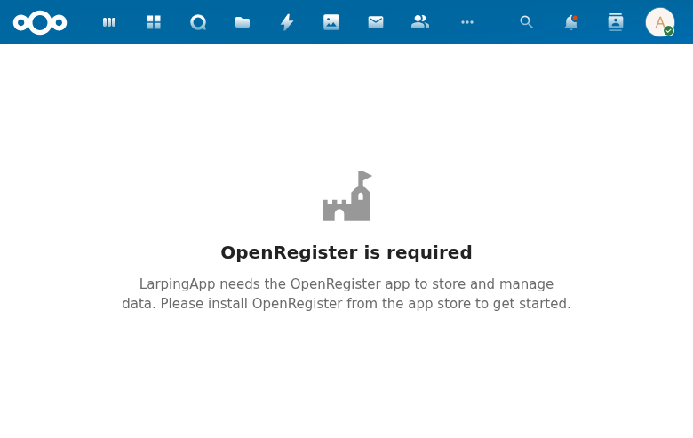

# Character Management

## Overview

Character Management provides full CRUD lifecycle management for LARP characters, including player characters, NPCs, and other character types. Characters are the central entity in LarpingApp, linking to skills, items, conditions, and events.

## Current State

The character list and detail views are currently blocked by the OpenRegister availability check in the compiled frontend. All character routes display the "OpenRegister is required" empty state.

**Source routes:**
- `/#/characters` -- Character list
- `/#/characters/:id` -- Character detail

## Features

### Character CRUD
- Create characters with name, description, background, faith, notice, and notes fields
- Update existing characters with all editable fields
- Delete characters with confirmation dialog
- List characters with search, pagination, and faceted results
- View single character detail page with tabbed interface

### Character Types and Approval
- Characters have a `type` field with values: `player`, `npc`, `other`
- Characters have an `approved` field with values: `no`, `approved`

### Stat Calculation Engine
- Automatic computation of ability scores based on associated effects
- Effects are collected from skills, items, conditions, and events
- Each effect targets a specific ability with a modifier value
- `allowed_negative` flag on abilities controls whether values can go below zero

### Currency System
- Gold, silver, and copper fields on characters
- Managed through the character edit interface

### Character-Player Association
- Characters link to player profiles via the `ocName` field
- Players are real-world people represented by Player objects

## Technical Details

| Component | Path |
|-----------|------|
| Entity | `lib/Db/Character.php` |
| Service | `lib/Service/CharacterService.php` |
| Controller | `lib/Controller/CharactersController.php` |
| List view | `src/entities/character/` |
| Detail view | Uses generic `ObjectDetail` component |

### Data Model

| Property | Type | Required | Description |
|----------|------|----------|-------------|
| id | UUID | Auto | Unique identifier |
| name | string | YES | Character name |
| description | string | No | Character description |
| background | string | No | Character backstory |
| faith | string | No | Character's faith/religion |
| notice | string | No | GM notes |
| notes | string | No | Additional notes |
| type | string | No | `player`, `npc`, or `other` |
| approved | string | No | `no` or `approved` |
| ocName | string | No | Link to Player object |
| gold | integer | No | Gold currency |
| silver | integer | No | Silver currency |
| copper | integer | No | Copper currency |

## Related Specs

- [Character Management Spec](../../openspec/specs/character-management/spec.md)
