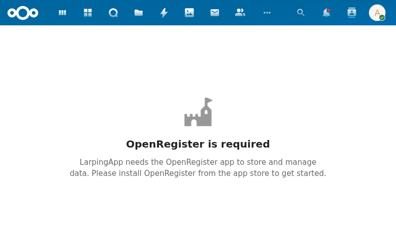

# Dashboard

## Overview

The Dashboard is the landing page of LarpingApp, serving as the entry point when users navigate to the app at `/apps/larpingapp/`. It provides a welcome view with planned analytics features.

## Current State

The dashboard is currently blocked by a stale compiled JS build that includes an OpenRegister availability check not present in the source code (`src/App.vue`). When OpenRegister is detected as unavailable by the compiled frontend, all routes -- including the dashboard -- display an "OpenRegister is required" empty state.

**Source route:** `/#/` (mapped to `DashboardIndex.vue`)

## Planned Features

The dashboard source code (`src/views/dashboard/DashboardIndex.vue`) includes:

- Welcome message with the app's castle icon
- Recent characters widget showing the user's latest characters
- Upcoming events widget showing events with date information
- Character stats overview with ApexCharts integration (dependency already included)
- Quick-action buttons for creating characters and events

## Technical Details

| Component | Path |
|-----------|------|
| Controller | `lib/Controller/DashboardController.php` |
| View | `src/views/dashboard/DashboardIndex.vue` |
| Navigation | `src/navigation/MainMenu.vue` |
| Route | `/#/` |

### Key Requirements (from spec)

- **DASH-001**: DashboardController serves a TemplateResponse for the root route `/`
- **DASH-002**: Template renders the `index` template from the `larpingapp` app
- **DASH-003**: Route is accessible without admin rights (`@NoAdminRequired`)
- **DASH-004**: Route does not require CSRF validation (`@NoCSRFRequired`)

## Related Specs

- [Dashboard Spec](../../openspec/specs/dashboard/spec.md)
