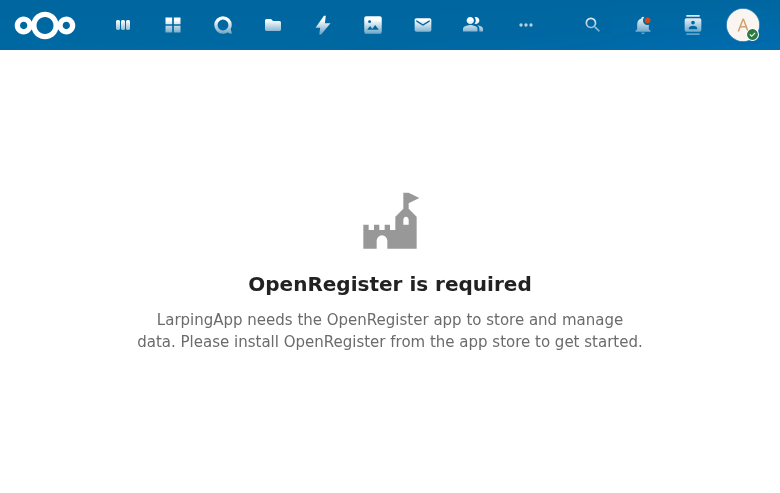

# Events and Players

## Overview

Manages LARP events (game gatherings with date ranges, locations, and participant tracking) and player profiles (real-world people who play characters). Events can carry Effects that are applied to participating characters during stat calculation.

## Current State

The events and players pages are currently blocked by the OpenRegister availability check in the compiled frontend.

**Source routes:**
- `/#/events` -- Events list
- `/#/events/:id` -- Event detail
- `/#/players` -- Players list
- `/#/players/:id` -- Player detail

## Features

### Event Management
- Create events with name, description, start date, end date, and location
- Update and delete events with confirmation dialog
- List events with search and pagination
- View event details with Characters (relations) and Logging tabs
- Assign players to events (`players[]` array)
- Assign effects to events (`effects[]` array) for post-event stat modifications
- Event effects are applied to associated characters during stat calculation

### Player Management
- Create player profiles with name and description
- Players represent real-world people who participate in LARP events
- Players link to characters via the character's `ocName` field
- A player can have multiple characters across different games/settings

### Event-Character-Effect Flow

1. Events are created with date ranges and locations
2. Players are assigned to events
3. Effects can be assigned to events (e.g., "survived the battle" XP bonus)
4. During stat calculation, event effects are applied to characters of assigned players

## Technical Details

| Component | Path |
|-----------|------|
| Event entity | `lib/Db/Event.php` |
| Player entity | `lib/Db/Player.php` |
| Event controller | `lib/Controller/EventsController.php` |
| Player controller | `lib/Controller/PlayersController.php` |
| Frontend entities | `src/entities/event/`, `src/entities/player/` |

### Event Data Model

| Property | Type | Required | Description |
|----------|------|----------|-------------|
| id | UUID | Auto | Unique identifier |
| name | string | YES | Event name |
| description | string | No | Event description |
| startDate | datetime | No | Event start date |
| endDate | datetime | No | Event end date |
| location | string | No | Event location |
| players | array | No | Assigned player UUIDs |
| effects | array | No | Assigned effect UUIDs |

### Player Data Model

| Property | Type | Required | Description |
|----------|------|----------|-------------|
| id | UUID | Auto | Unique identifier |
| name | string | YES | Player name |
| description | string | No | Player description |

## Related Specs

- [Events and Players Spec](../../openspec/specs/events-players/spec.md)
