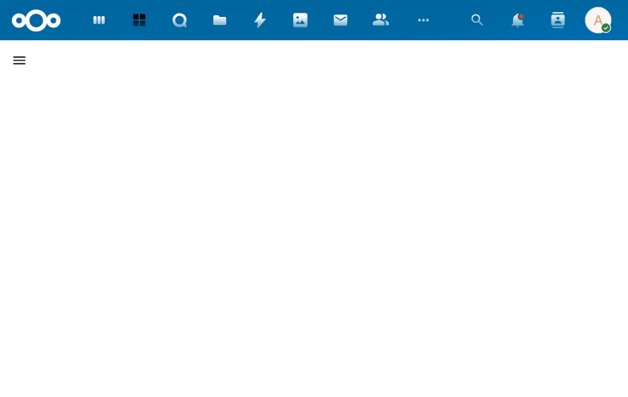

# Larping Skill Widget

## Overview

A dashboard widget that visualizes skill usage distribution across characters using a donut chart. Data is fetched via OpenRegister's GraphQL faceting API.

## Features

- **Donut chart** showing skill distribution across all characters
- **Top 10 skills** displayed as individual slices, remaining grouped as "Other"
- **Theme-aware** rendering (supports dark mode)
- **Loading state** with spinner during data fetch
- **Empty state** message when no skill data available
- **Error state** with retry button on fetch failure
- **OpenRegister check** — verifies configuration before querying

## Data Source

Uses GraphQL faceting query:
```graphql
{
  character(first: 1, facets: ["skills"]) {
    totalCount
    facets
  }
}
```

## Screenshot



## Technical Details

- Component: `SkillUsageChart.vue`
- Chart library: VueApexCharts (donut type)
- Data: OpenRegister GraphQL faceting API via `services/graphql.js`
- Theme detection: `document.body.dataset.themeDark` and `prefers-color-scheme` media query
