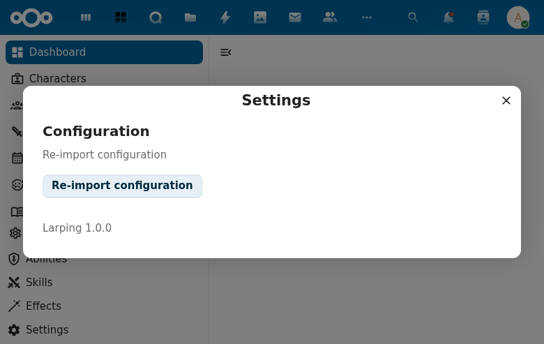

# User Settings

## Overview

Provides a settings dialog accessible from the navigation footer, allowing users to re-import configuration.

## Features

- **Settings gear icon** in navigation footer opens the dialog
- **Configuration section** with re-import button
- **Loading state** during re-import operation
- **Success/failure feedback** after re-import

## How to Access

1. Open LarpingApp
2. Click the Settings gear in the navigation footer
3. The Settings dialog opens with the Configuration section

## Screenshot

## Technical Details

- Component: `UserSettings.vue` using `NcAppSettingsDialog`
- Integration: Hosted in `App.vue` with `showSettingsDialog` state
- Store: `settings.js` with `reimportConfiguration()` action
- Backend: `SettingsController.reimport()` endpoint
